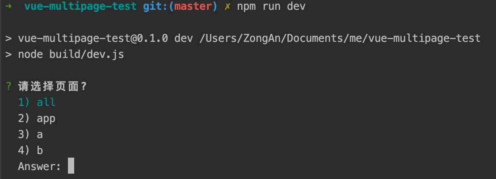
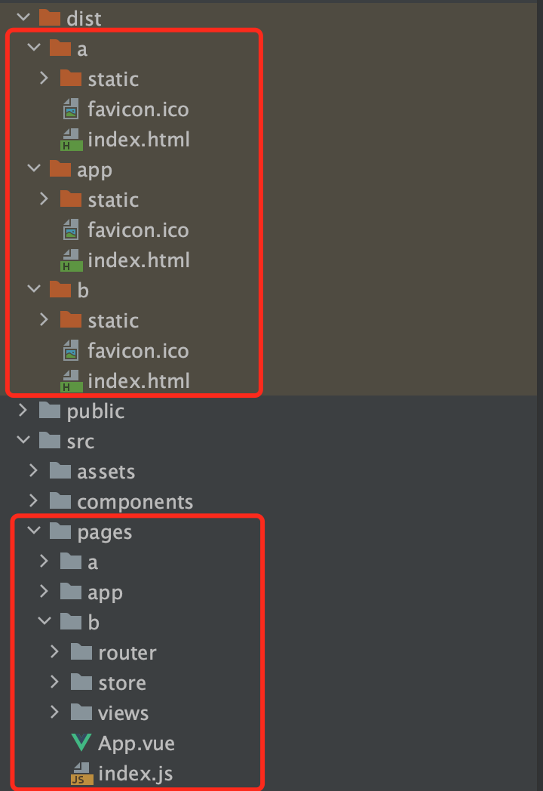

# vue多页面应用打包框架

### 使用说明
#### 开发
```
npm run dev
```
`.env.development`中如果配置了BUILD_PAGE，则浏览器打开看到的就是该页面。 如果没有配置会提示选择开发页面，可以选择单个页面，也可以选择all。选择all会编译所有页面，并且有一个主页面可以跳转每个子页面。


#### 打包所有页面
```
npm run build-all [mode]
```
#### 打包单个页面
```
npm run build a [mode]
```
`[mode]`可选值`separate`和`merge`, `separate`模式将每个页面单独打包到一个文件夹，适用于分开部署，重复的代码不能复用；`merge`模式将所有文件打包到一个文件夹，适用于部署到同一个服务下，重复代码可复用。
#### 打包输出结果


### pages-conf
`pages-conf.js` 页面配置文件，新增页面需要在这里配置。
```vue
{
  app:{
    entry: 'src/pages/app/index.js',  // 入口文件
    template: 'public/index.html',    // 模版
    filename: 'index.html',           // 打包后的文件名，index.html为默认主页
    title: '应用集成'                   // 标题
  },
  a: {
    entry: 'src/pages/a/index.js',
    template: 'public/index.html',
    filename: 'a.html',
    title: 'A页面'
  },
  b: {
    entry: 'src/pages/b/index.js',
    template: 'public/index.html',
    filename: 'b.html',
    title: 'B页面'
  }
}
```

### build文件夹
#### build.js
为打包单个页面配置所需变量
```javascript
const buildPage = function(pageName){
  // 检查打包的页面名称是否合法
  if(!(pageName in pagesConfig)){
    console.log(chalk.red('该页面不在pages-conf.js文件中，请检查配置。'))
    process.exit(1)
  }
  console.log(chalk.yellow(`正在打包: ${pageName}`))
  // 配置当前打包页面环境变量，在后面的vue.config.js中用到
  process.env.BUILD_PAGE = pageName
  // 执行打包命令
  execFileSync( 'vue-cli-service', ['build'], {
    stdio: ['inherit', 'inherit', 'inherit']
  })
  console.log(chalk.green(`页面${pageName}打包完成`))
}
```
#### build-all.js
```javascript
const spinner = ora('开始打包...')
spinner.start()
// 移除dist目录
rm(path.join('dist'), err=>{
  if (err) throw err
  spinner.stop()
  // 循环调用单个打包命令
  Object.keys(pagesConfig).map(pageName=>{
    // 异步执行构建文件，并传入两个参数，module：当前打包模块，separate：当前打包模式（分开打包）
    execFileSync( 'node', [buildFile, pageName, process.env.BUILD_MODE || 'separate'], {
      stdio: ['inherit', 'inherit', 'inherit']
    })
  })
})
```
#### dev.js
```javascript
const runDev = function(){
  // 执行跑服务命令
  execFileSync('vue-cli-service', ['serve'], {
    stdio: ['inherit', 'inherit', 'inherit']
  })
}

if(!process.env.BUILD_PAGE){
  const inquirer = require('inquirer')
  const pages = require('../pages-conf')
  // 如果没有配置当前开发页面，提供选择
  inquirer.prompt([{
    type: 'rawlist',
    name: 'module',
    message: '请选择页面?',
    choices: ['all', ...Object.keys(pages)],
    default: true
  }]).then((answers) => {
    let module = answers.module
    if(module === 'all') module = ''
    // 配置当前调试页面, 在后面的vue.config.js中用到
    process.env.BUILD_PAGE = module
    runDev()
  })
}else{
  runDev()
}
```

### vue.config.js
```js
const pages = require('./pages-conf')

const getPage = function(pageName){
  if(!pageName) return pages
  return {
    [pageName]: Object.assign(pages[pageName], {filename: 'index.html'})
  }
}

const config = {
  // 根据模式选择输出目录
  outputDir: process.env.NODE_ENV === 'production' && process.env.BUILD_MODE === 'separate' ? `dist/${process.env.BUILD_PAGE}` : 'dist',
  assetsDir: 'static',
  pages: getPage(process.env.BUILD_PAGE)  // 根据环境变量获取页面
}
```

